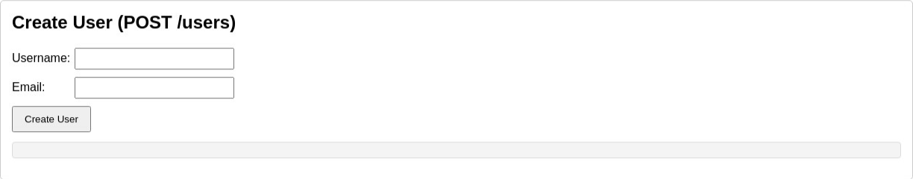
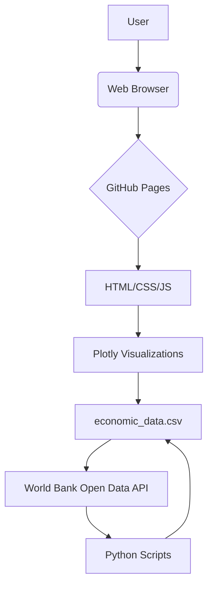

# Economic Data Dashboard

A comprehensive interactive dashboard for analyzing global economic indicators from World Bank Open Data.

## Features

- **Interactive Visualizations**: GDP trends, population growth, and correlation analysis
- **Comprehensive Data**: 217 countries analyzed from 2015-2024
- **Real-time Data**: Sourced from World Bank Open Data API
- **Responsive Design**: Works on desktop and mobile devices

## Data Sources

- **World Bank Open Data**: Primary source for economic indicators
- **Key Indicators**: GDP (current US$) and Population totals
- **Coverage**: 217 countries, 2015-2024 period

## Technology Stack

- **Backend**: Python Flask
- **Data Processing**: Pandas, World Bank Data API
- **Visualizations**: Plotly
- **Frontend**: HTML, CSS, JavaScript
- **Deployment**: GitHub Pages

## Local Development

1. Clone the repository
2. Navigate to the project directory
3. Create and activate virtual environment:
   ```bash
   python -m venv venv
   source venv/bin/activate  # On Windows: venv\\Scripts\\activate
   ```
4. Install dependencies:
   ```bash
   pip install -r requirements.txt
   ```
5. Run the application:
   ```bash
   python src/main.py
   ```
6. Open http://localhost:5000 in your browser

## Data Processing

The dashboard extracts data using the World Bank API, focusing on:
- GDP (current US$) - NY.GDP.MKTP.CD
- Population, total - SP.POP.TOTL

Countries are filtered to exclude regional aggregates and focus on individual nation-states.

## Visualizations

1. **GDP Trends Over Time**: Line chart showing GDP evolution for major economies
2. **Population Growth**: Population trends for selected countries
3. **GDP vs Population Correlation**: Scatter plot with logarithmic scaling

## License

This project is open source and available under the MIT License.

## Live Demo

Access the live dashboard here: [Economic Data Dashboard](https://tomoto0.github.io/economic-data-dashboard/)

### Screenshot



## Architecture Diagram




